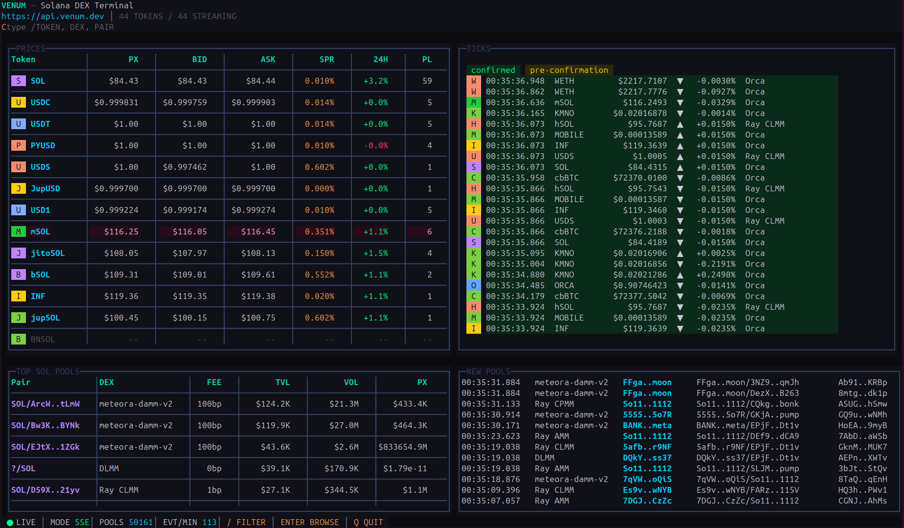

# Venum Terminal

Composable Solana execution infrastructure, in your terminal.

`Venum Terminal` is an open-source TUI for exploring real-time Solana market data powered by [Venum](https://www.venum.dev). It is built for builders, traders, and agent workflows that want a fast, keyboard-first view into prices, pools, and live market activity.

Built on [OpenTUI](https://github.com/anomalyco/opentui).

- Website: [www.venum.dev](https://www.venum.dev)
- Docs: [docs.venum.dev](https://docs.venum.dev)



Venum’s broader product direction is simple:

> Less raw RPC. More executable actions.

This terminal is part of that OSS surface.

## What It Does

- Streams live token prices in a dense terminal layout
- Surfaces new pool discovery in real time
- Tracks top SOL pools
- Supports quick keyboard filtering and browsing
- Works with or without an API key

## Why It Exists

Most Solana apps and bots use more raw RPC than they should.

Venum is building a higher-level execution surface for builders: prices, pools, quotes, transaction building, submission, and agent-friendly tooling. `Venum Terminal` is the terminal-native window into that world: fast, composable, and easy to try.

## Install

Run without cloning:

```bash
bunx @venumdev/terminal
```

Clone and run locally:

```bash
git clone https://github.com/venumhq/solana-venum-terminal.git
cd solana-venum-terminal
bun install
bun start
```

Install globally:

```bash
bun install -g @venumdev/terminal
venum-terminal
```

## Requirements

- [Bun](https://bun.sh) `>= 1.3.0`
- [Zig](https://ziglang.org/download/) `>= 0.15.0`

## API Key

The terminal works without an API key, but a key unlocks the full live streaming experience.

Get one at [www.venum.dev](https://www.venum.dev).

Documentation is available at [docs.venum.dev](https://docs.venum.dev).

You can provide it at launch or pass it directly:

```bash
VENUM_API_KEY=your_key bun start
```

## Usage

Default launch:

```bash
bun start
```

Run directly via Bun without cloning:

```bash
bunx @venumdev/terminal
```

Custom API URL:

```bash
bun run src/index.ts https://localhost:3000
```

## Keyboard

- `/` focus filter
- `Esc` clear filter or exit drill-down
- `Enter` open token browser
- `Up` / `Down` navigate selectors
- `q` quit

## Screens

- `PRICES` for live token pricing
- `TICKS` for market updates
- `TOP SOL POOLS` for active pool surfaces
- `NEW POOLS` for newly discovered listings

## Who It Is For

- Solana builders
- trading bot developers
- terminal-first traders
- coding agents and agent operators
- anyone who wants a fast OSS market view without living in a browser

## Open Source

This project is part of the Venum OSS adoption layer: CLI-first, builder-friendly, and designed to be easy to try, inspect, and extend.

If you care about:

- composability
- agent-friendly tooling
- terminal workflows
- better developer ergonomics on Solana

this repo is for you.

## Development

Watch mode:

```bash
bun run dev
```

Build:

```bash
bun run build
```

## License

MIT
